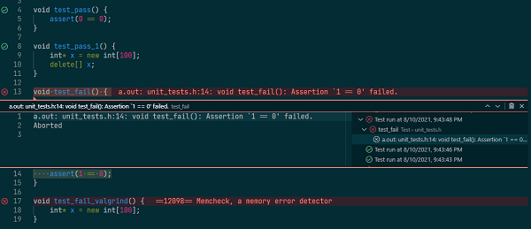
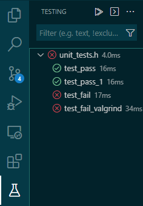
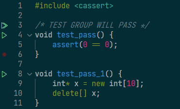

# vscode-cpp-unit-test
A simple and sweet VSCode extension to unit test C++ code.

## Setup
To use the extension, you'll need to:
1)  Create a unit_tests.h file
2)  Set up your Makefile
3)  Start testing your code! 

NOTE: Please follow these instructions carefully!

### Getting started
If you haven't already, [install the C++ Unit Testing Framework by AutumnMoon from the VSCode Marketplace](https://marketplace.visualstudio.com/items?itemName=AutumnMoon.cpp-unit-test). 

Then, create and move into a new folder. 

```
mkdir unittest_demo 
cd unittest_demo
```

Now, create a Makefile and unit_tests.h file:

```touch Makefile unit_tests.h```

Wonderful! Now, open this folder in a new workspace:

```code .```

If you see the testing panel open on the left-hand window, like in the image below then you're good to go. If not, ensure that the above two files are in your cwd, and again run ```code .``` again (the extension will only activate if you have a file named ```unit_tests.h``` in your workspace on launch of the VSCode instance, which minimizes its footprint in other contexts). Once the extension is loaded in your VSCode workspace, it will discover tests as you write them, and will recompile your code automatically when you run your tests.


Note! Whenever you plan to use the unit_test framework, please run ```code .``` to initialize a workspace in the directory where you are working. This way, the correct ```unit_tests.h``` script will be used! 

### unit_tests.h

Now, we'll edit ```unit_tests.h```. This file will hold your test functions, each of which:

1)  returns ```void```
2)  takes no arguments
3)  has a unique test function name

For instance, your ```unit_tests.h``` file might read:

```cpp
#include <cassert>

void test_pass() {
    assert(0 == 0);
}

void test_fail() {
    assert(1 == 0);
}

void test_fail_valgrind() {
    int *x = new int[100];
}
```

```assert``` statements are encouraged.

Each test will effectively be run as its own 'main' by a driver that the extension creates for you. Valgrind will also be run on the test. 

A test is considered successful if it finishes execution; it will fail if either the main test fails or if valgrind fails (valgrind is run with --leak-check=full and --show-leak-kinds=all).

Also, tests that diff against expected output are supported. Any file with the same name as a test in a folder named stdout/ will automatically be diff'd against the stdout of that test. See the sample/ for examples.

The last thing to do is to set up the Makefile.

## Makefile
Your ```Makefile``` will need a rule named ```unit_test``` which links your code with a file named ```unit_test_driver.o```. This is a custom driver file built by the extension that includes a ```main``` function. 

```bash
CXX: clang++

unit_test: unit_test_driver.o 
    $(CXX) unit_test_driver.o
```
## Save
Make sure you've saved both files.

## Run Your Tests
Navigate back to ```unit_tests.h```. You should see 'play' buttons next to each test declaration. 


Press each one to play its test.



You can also head to the 'test explorer panel, where there is an overview of all tests, and a button to run all tests together. 



You can also create test groups with a comment above the first test in a group as follows:

```/* TEST GROUP SOMENAME */```

(A regex is looking for the phrase ```TEST GROUP```).



Test groups are hierarchical - each group will run all groups below it. If you want to create more distinct test groups, you can create any number of files named XXX_tests.h, each of which has testing functions. These will be able to be run independently of one another. Note that each such file in your workspace will be ```#include```d in the testing driver; also, each test function name even across multiple files must be unique. When running test groups or all tests from all files, the code will be compiled only once.

That's it! Happy testing :)

Matt

PS: Many thanks to [https://github.com/microsoft/vscode-extension-samples](https://github.com/microsoft/vscode-extension-samples) for having some great examples to work from.
